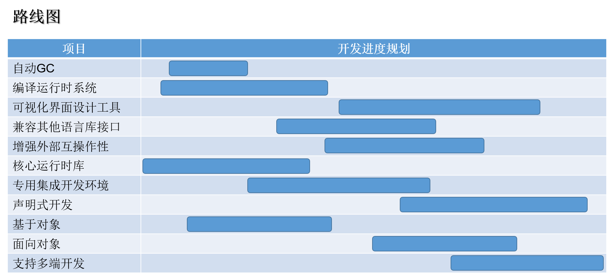
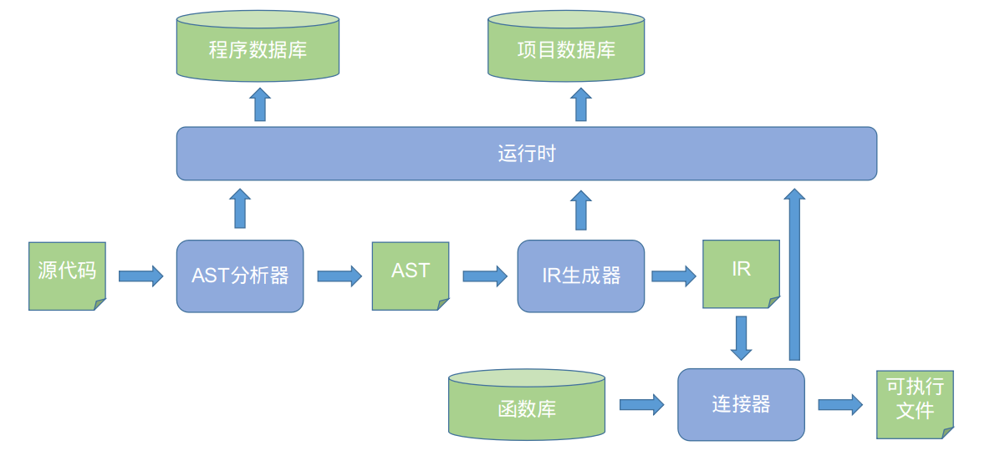

# REXLang 自述文件

REXLang 即 快速表达扩展语言（Rapid Expression eXtension Language）。

## 开源许可

本项目使用Apache License v2.0许可证进行发布，并在此基础上增加了扩展条例，以确保原作者和参与者的权利。详情请阅读根目录下的License.txt文件。

## 引用的开源库

### ANTLR

项目地址：https://github.com/antlr/antlr4

引用版本：4.7.2

开源许可证：BSD 3-clause license

备注：除了安装Antlr4运行程序，还需要安装其中的C++运行时库。

### LLVM

项目地址：https://github.com/llvm/llvm-project

引用版本：9.0.1

开源许可证：Apache License Version 2.0

备注：主要使用了静态版本，Linux下可以通过包管理器直接安装LLVM-9。

## 语法设计说明

以易语言语法为蓝本，扩充了一些关键字和语法特性。

## 目标和愿景

- 快速原型开发和算法验证；

- 非编程专业人士也能轻松开发软件；

- 设计即产品（Design as a Product）。

## 项目现状

- 完成对编译系统框架的搭建；

- 完成了基础语法文件；

- 完成了从编译到最终可执行程序生成的主流程；

- 实现了部分字符串和数组的运行时静态库。

## 路线图

1. 实现自动GC功能

2. 基本完成核心运行时库

3. 完善编译运行时系统

4. 专用集成开发环境

5. 可视化界面设计工具

6. 声明式开发

7. 兼容其他语言的C接口

8. 先基于对象再面向对象

9. 增强网页、COM等互操作性

10. 原生支持多端开发

11. ......

## 系统概述

## 构建安装

参见 INSTALL.md 文件。
